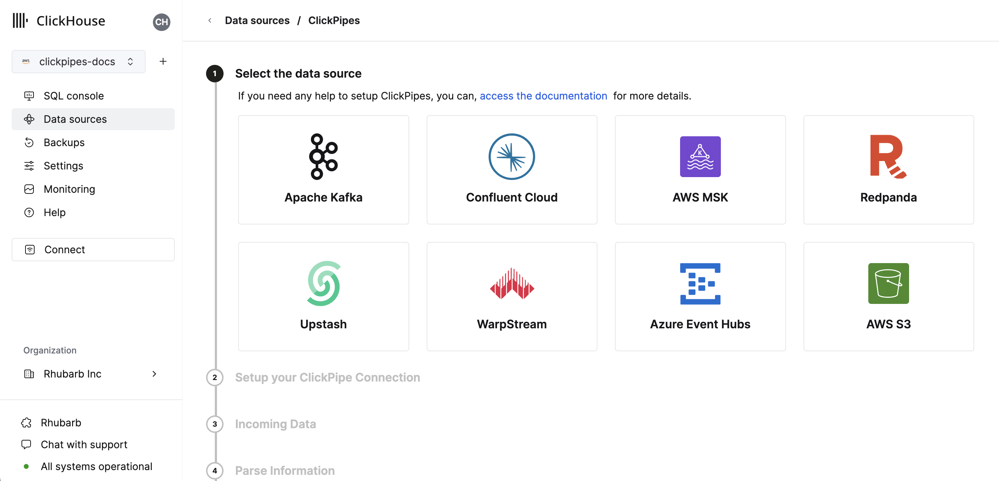
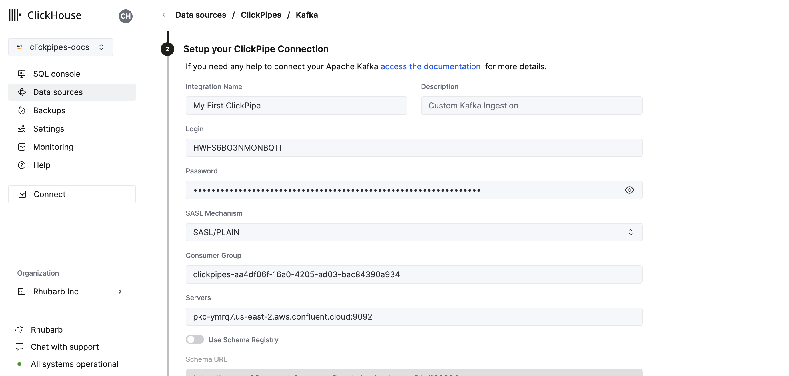
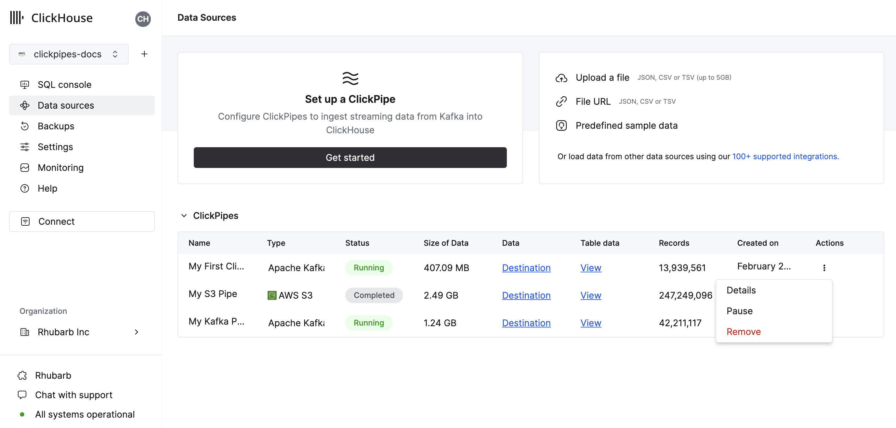

import KafkaSVG from "../../images/logos/kafka.svg";
import ConfluentSVG from "../../images/logos/confluent.svg";
import MskSVG from "../../images/logos/msk.svg";
import AzureEventHubsSVG from "../../images/logos/azure_event_hubs.svg";
import UpstashSVG from "../../images/logos/upstash.svg";
import WarpStreamSVG from "../../images/logos/warpstream.svg";
import S3SVG from "../../images/logos/amazon_s3_logo.svg";
import GCSSVG from "../../images/logos/gcs.svg";

# Integrating with ClickHouse Cloud

## Introduction

[ClickPipes](https://clickhouse.com/cloud/clickpipes) is a managed integration platform that makes ingesting data from a diverse set of sources as simple as clicking a few buttons. Designed for the most demanding workloads, ClickPipes's robust and scalable architecture ensures consistent performance and reliability. ClickPipes can be used for long-term streaming needs or one-time data loading job.

## Creating your first ClickPipe

1. Access the SQL Console for your ClickHouse Cloud Service.

  

2. Select the `Imports` button on the left-side menu and click on "Set up a ClickPipe"

  

3. Select your data source.

  

4. Fill out the form by providing your ClickPipe with a name, a description (optional), your credentials, and other connection details.
:::note
Currently ClickPipes does not support loading custom CA certificates.
:::

  

5. Configure the schema registry. A valid schema is required for Avro streams and optional for JSON. This schema will be used to parse [AvroConfluent](../../../interfaces/formats.md/#data-format-avro-confluent) or validate JSON messages on the selected topic.
Avro messages that can not be parsed or JSON messages that fail validation will generate an error.  Note that ClickPipes will automatically retrieve an updated or different schema from the registry if indicated by the schema ID embedded in the message.
There are two ways to format the URL path to retrieve the correct schema:
- the path `/schemas/ids/[ID]` to the schema document by the numeric schema id. A complete url using a schema id would be `https://registry.example.com/schemas/ids/1000`
- the path `/subjects/[subject_name]` to the schema document by subject name.  Optionally, a specific version can be referenced by appending `/versions/[version]` to the url (otherwise ClickPipes
will retrieve the latest version).  A complete url using a schema subject would be `https://registry.example.com/subjects/events` or `https://registry/example.com/subjects/events/versions/4`

6. Select your data format (we currently support a subset of ClickHouse formats). The UI will display a sample document from the selected source (Kafka topic, etc).

  

7. In the next step, you can select whether you want to ingest data into a new ClickHouse table or reuse an existing one. Follow the instructions in the screen to modify your table name, schema, and settings. You can see a real-time preview of your changes in the sample table at the top.

  

  You can also customize the advanced settings using the controls provided

  

8. Alternatively, you can decide to ingest your data in an existing ClickHouse table. In that case, the UI will allow you to map fields from the source to the ClickHouse fields in the selected destination table.

  

9. Finally, you can configure permissions for the internal clickpipes user.

**Permissions:** ClickPipes will create a dedicated user for writing data into a destination table. You can select a role for this internal user using a custom role or one of the predefined role:
    - `Full access`: with the full access to the cluster. It might be useful if you use Materialized View or Dictionary with the destination table.
    - `Only destination table`: with the `INSERT` permissions to the destination table only.

  

10. By clicking on "Complete Setup", the system will register you ClickPipe, and you'll be able to see it listed in the summary table.

  

  

  The summary table provides controls to display sample data from the source or the destination table in ClickHouse

  

  As well as controls to remove the ClickPipe and display a summary of the ingest job.

  

**Error table**: ClickPipes will create a table next to your destination table with the postfix `_clickpipes_error`. This table will contain any errors from the operations of your ClickPipe (network, connectivity, etc.) and also any data that don't conform to the schema specified in the previous screen. The error table has a [TTL](https://clickhouse.com/docs/en/engines/table-engines/mergetree-family/mergetree#table_engine-mergetree-ttl) of 7 days.

11. **Congratulations!** you have successfully set up your first ClickPipe. If this is a streaming ClickPipe it will be continuously running, ingesting data in real-time from your remote data source. Otherwise it will ingest the batch and complete.

## Supported Data Sources

|Name|Logo|Type|Status|Description|
|----|----|----|------|-----------|
|Apache Kafka|<KafkaSVG style={{width: '3rem', 'height': '3rem'}} />|Streaming|Stable|Configure ClickPipes and start ingesting streaming data from Apache Kafka into ClickHouse Cloud.|
|Confluent Cloud|<ConfluentSVG style={{width: '3rem'}} />|Streaming|Stable|Unlock the combined power of Confluent and ClickHouse Cloud through our direct integration.|
|Redpanda||Streaming|Stable|Configure ClickPipes and start ingesting streaming data from RedPanda into ClickHouse Cloud.|
|AWS MSK|<MskSVG style={{width: '3rem', 'height': '3rem'}} />|Streaming|Stable|Configure ClickPipes and start ingesting streaming data from AWS MSK into ClickHouse Cloud.|
|Azure Event Hubs|<AzureEventHubsSVG style={{width: '3rem'}} />|Streaming|Stable|Configure ClickPipes and start ingesting streaming data from Azure Event Hubs into ClickHouse Cloud.|
|Upstash|<UpstashSVG style={{width: '3rem'}} />|Streaming|Stable|Configure ClickPipes and start ingesting streaming data from Upstash into ClickHouse Cloud.|
|WarpStream|<WarpStreamSVG style={{width: '3rem'}} />|Streaming|Stable|Configure ClickPipes and start ingesting streaming data from WarpStream into ClickHouse Cloud.|
|Amazon S3|<S3SVG style={{width: '3rem', height: 'auto'}} />|Object Storage|Beta|Configure ClickPipes to ingest large volumes of data from object storage.|
|Google Cloud Storage|<GCSSVG style={{width: '3rem', height: 'auto'}} />|Object Storage|Beta|Configure ClickPipes to ingest large volumes of data from object storage.|

More connectors are will get added to ClickPipes, you can find out more by [contacting us](https://clickhouse.com/company/contact?loc=clickpipes).

## Supported data formats

The supported formats are:

| Format| Kafka Streaming | Object Storage |
|-------|-------|----------------|
| [JSON](../../../interfaces/formats.md/#json)                               | ✔           | ✔           |
| [CSV](../../../interfaces/formats.md/#csv)                                 |*Coming Soon*| ✔           |
| [TabSeparated](../../../interfaces/formats.md/#tabseparated)               |*Coming Soon*| ✔           |
| [Parquet](../../../interfaces/formats.md/#parquet)                         |❌            | ✔           |
| [AvroConfluent](../../../interfaces/formats.md/#data-format-avro-confluent)|✔            | ❌           |

## Supported data types (JSON)

The following ClickHouse types are currently supported for JSON payloads:

- Base numeric types
  - Int8
  - Int16
  - Int32
  - Int64
  - UInt8
  - UInt16
  - UInt32
  - UInt64
  - Float32
  - Float64
- Boolean
- String
- FixedString
- Date, Date32
- DateTime, DateTime64
- Enum8/Enum16
- LowCardinality(String)
- Map with keys and values using any of the above types (including Nullables)
- Tuple and Array with elements using any of the above types (including Nullables, one level depth only)
- JSON/Object('json'). experimental

:::note
Nullable versions of the above are also supported with these exceptions:

- Nullable Enums are **not** supported
- LowCardinality(Nullable(String)) is **not** supported

:::

## Kakfa Virtual Columns

The following virtual columns are support for Kafka compatible streaming data sources.  When creating a new destination table virtual columns can be added by using the `Add Column` button.

| Name       | Description       | Recommend Data Type |
|------------|-------------------|---------------------|
| _key       | Kafka Message Key | String              |
| _timestamp | Kafka Timestamp   | DateTime64(3)       |
| _partition | Kafka Partition   | Int32               |
| _offset    | Kafka Offset      | Int64               |

## Supported data types (Avro)

ClickPipes supports all Avro Primitive and Complex types, and all Avro Logical types except `time-millis`, `time-micros`, `local-timestamp-millis`, `local_timestamp-micros`, and `duration`.  Avro `record` types are converted to Tuple, `array` types to Array, and `map` to Map (string keys only).  In general the conversions listed [here](../../../../en/interfaces/formats.md#data-types-matching) are available.  We recommend using exact type matching for Avro numeric types, as ClickPipes does not check for overflow or precision loss on type conversion.

## Avro Schema Management

ClickPipes dynamically retrieves and applies the Avro schema from the configured Schema Registry using the schema ID embedded in each message/event.  Schema updates are detected and processed automatically.

At this time ClickPipes is only compatible with schema registries that use the [Confluent Schema Registry API](https://docs.confluent.io/platform/current/schema-registry/develop/api.html).  In addition to Confluent Kafka and Cloud, this includes the RedPanda, AWS MSK, and Upstash schema registries.  ClickPipes is not currently compatible with the AWS Glue Schema registry or the Azure Schema Registry (coming soon).

The following rules are applied to the mapping between the retrieved Avro schema and the ClickHouse destination table:
- If the Avro schema contains a field that is not included in the ClickHouse destination mapping, that field is ignored.
- If the Avro schema is missing a field defined in the ClickHouse destination mapping, the ClickHouse column will be populated with a "zero" value, such as 0 or an empty string.  Note that [DEFAULT](https://clickhouse.com/docs/en/sql-reference/statements/create/table#default) expressions are not currently evaluated for ClickPipes inserts (this is temporary limitation pending updates to the ClickHouse server default processing).
- If the Avro schema field and the ClickHouse column are incompatible, inserts of that row/message will fail, and the failure will be recorded in the ClickPipes errors table.  Note that several implicit conversions are supported (like between numeric types), but not all (for example, an Avro `record` field can not be inserted into an `Int32` ClickHouse column).

## ClickPipes Limitations

- Private Link support isn't currently available for ClickPipes but will be released in the near future. Please contact us to express interest.
- [DEFAULT](https://clickhouse.com/docs/en/sql-reference/statements/create/table#default) is not supported.

### S3 / GCS ClickPipe Limations

  - ClickPipes will only attempt to ingest objects at 1GB or smaller in size.
  - S3 / GCS ClickPipes **does not** share a listing syntax with the [S3 Table Function](https://clickhouse.com/docs/en/sql-reference/table-functions/file#globs_in_path).
    - `?` — Substitutes any single character
    - `*` — Substitutes any number of any characters except / including empty string
    - `**` — Substitutes any number of any character include / including empty string

:::note
This is a valid path:

https://datasets-documentation.s3.eu-west-3.amazonaws.com/http/**.ndjson.gz

This is not a valid path. `{N..M}` are not supported in ClickPipes.

https://datasets-documentation.s3.eu-west-3.amazonaws.com/http/{documents-01,documents-02}.ndjson.gz
:::

## List of Static IPs

The following are the static NAT IPs that ClickPipes uses to connect to your Kafka brokers separated by region.
Add your related instance region IPs to your IP allowlist to allow traffic.
If your instance region is not listed here, it will fall to the default region:

- **eu-central-1** for EU regions
- **us-east-1** for instances in `us-east-1`
- **us-east-2** for other all regions

| ClickHouse Cloud region | IP Addresses |
|-------------------------|--------------|
| **eu-central-1**        | `18.195.233.217`, `3.127.86.90`, `35.157.23.2` |
| **us-east-2**           | `3.131.130.196`, `3.23.172.68`, `3.20.208.150` |
| **us-east-1**           | `54.82.38.199`, `3.90.133.29`, `52.5.177.8`, `3.227.227.145`, `3.216.6.184`, `54.84.202.92`, `3.131.130.196`, `3.23.172.68`, `3.20.208.150` |

## Adjusting ClickHouse settings
ClickHouse Cloud provides sensible defaults for most of the use cases. However, if you need to adjust some ClickHouse settings for the ClickPipes destination tables, a dedicated role for ClickPipes is the most flexible solution.
Steps:
1. create a custom role `CREATE ROLE my_clickpipes_role SETTINGS ...`. See [CREATE ROLE](/docs/en/sql-reference/statements/create/role.md) syntax for details.
2. add the custom role to ClickPipes user on step `Details and Settings` during the ClickPipes creation.

- **What is ClickPipes?**

  ClickPipes is a ClickHouse Cloud feature that makes it easy for users to connect their ClickHouse services to external data sources, specifically Kafka. With ClickPipes for Kafka, users can easily continuously load data into ClickHouse, making it available for real-time analytics.

- **What types of data sources does ClickPipes support?**

  Currently, ClickPipes supports Confluent Cloud, AWS MSK, and Apache Kafka as data sources. However, we are committed to expand our support for more data sources in the future. Don't hesitate to [contact us](https://clickhouse.com/company/contact?loc=clickpipes) if you want to know more.

- **How does ClickPipes for Kafka work?**

  ClickPipes uses a dedicated architecture running the Kafka Consumer API to read data from a specified topic and then inserts the data into a ClickHouse table on a specific ClickHouse Cloud service.

- **What's the difference between ClickPipes and the ClickHouse Kafka Table Engine?**

  The Kafka Table engine is a ClickHouse core capability that implements a “pull model” where the ClickHouse server itself connects to Kafka, pulls events then writes them locally.

  ClickPipes is a separate cloud service that runs independently of the ClickHouse Service, it connects to Kafka (or other data sources) and pushes events to an associated ClickHouse Cloud service. This decoupled architecture allows for superior operational flexibility, clear separation of concerns, scalable ingestion, graceful failure management, extensibility and more.

- **What are the requirements for using ClickPipes for Kafka?**

  In order to use ClickPipes for Kafka, you will need a running Kafka broker and a ClickHouse Cloud service with ClickPipes enabled. You will also need to ensure that ClickHouse Cloud can access your Kafka broker. This can be achieved by allowing remote connection on the Kafka side, whitelisting [ClickHouse Cloud Egress IP addresses](https://clickhouse.com/docs/en/manage/security/cloud-endpoints-api) in your Kafka setup. Support for AWS Private Link is coming soon.

- **Can I use ClickPipes for Kafka to write data to a Kafka topic?**

  No, the ClickPipes for Kafka is designed for reading data from Kafka topics, not writing data to them. To write data to a Kafka topic, you will need to use a dedicated Kafka producer.

- **What data formats are supported by ClickPipes for Kafka?**

  The list of supported data types is [displayed above](#supported-data-types).

- **Does ClickPipes support data transformation?**

  Yes, ClickPipes supports basic data transformation by exposing the DDL creation. You can then apply more advanced transformations to the data as it is loaded into its destination table in a ClickHouse Cloud service leveraging ClickHouse's [materialized views feature](https://clickhouse.com/docs/en/guides/developer/cascading-materialized-views).

- **What delivery semantics ClickPipes for Kafka supports?**

  ClickPipes for Kafka provides `at-least-once` delivery semantics (as one of the most commonly used approaches). We'd love to hear your feedback on delivery semantics (contact form)[https://clickhouse.com/company/contact?loc=clickpipes]. If you need exactly-once semantics, we recommend using our official [`clickhouse-kafka-connect`](https://clickhouse.com/blog/real-time-event-streaming-with-kafka-connect-confluent-cloud-clickhouse) sink.

- **Is there a way to handle errors or failures when using ClickPipes for Kafka?**

  Yes, ClickPipes for Kafka will automatically retry case of failures when consuming data from Kafka. ClickPipes also supports enabling a dedicated error table that will hold errors and malformed data for 7 days.

- **Does ClickPipes support multiple brokers?**

  Yes, if the brokers are part of the same quorum they can be configured together delimited with ','.

- **Does using ClickPipes incur an additional cost?**

  ClickPipes is not billed separately at the moment. Running ClickPipes might generate an indirect compute and storage cost on the destination ClickHouse Cloud service like any ingest workload.

- **What authentication mechanisms are supported for ClickPipes for Kafka?**

  For Apache Kafka protocol data sources, ClickPipes supports [SASL/PLAIN](https://docs.confluent.io/platform/current/kafka/authentication_sasl/authentication_sasl_plain.html) authentication with TLS encryption, as well as `SASL/SCRAM-SHA-256` and `SASL/SCRAM-SHA-512`. Depending on the streaming source (Redpanda, MSK, etc) will enable all or a subset of these auth mechanisms based on compatibility. If you auth needs differ please (give us feedback)[https://clickhouse.com/company/contact?loc=clickpipes].

- **Do you support schema registries for managed Kafka Providers?**

You can also select a Schema Registry server and credentials to handle your decoding and validation (Currently only available for Confluent Cloud).

- **Does ClickPipes AWS MSK support IAM authentication?**

AWS MSK authentication currently only supports [SASL/SCRAM-SHA-512](https://docs.aws.amazon.com/msk/latest/developerguide/msk-password.html) authentication. IAM authentication is coming soon.

- **What authentication does ClickPipes support for S3 Buckets?**

You can access public buckets with no configuration, and with protected buckets you can use [IAM credentials](https://docs.aws.amazon.com/IAM/latest/UserGuide/id_credentials_access-keys.html) or an [IAM Role](https://docs.aws.amazon.com/IAM/latest/UserGuide/id_roles.html). You can [refer to this guide](../../../cloud/security/secure-s3.md) to understand the required permission for accessing your data.

- **Does ClickPipes support Service Accounts for GCS?**

No, not directly. HMAC (IAM) Credentials must be used when authenticating with non-public buckets.

- **What authentication does ClickPipes support for GCS Buckets?**

Like S3, you can access public buckets with no configuration, and with protected buckets you can use [HMAC Keys](https://cloud.google.com/storage/docs/authentication/managing-hmackeys) in place of the AWS IAM credentials. You can read this guide from Google Cloud on [how to setup such keys](https://cloud.google.com/storage/docs/authentication/hmackeys).

- **What permissions should the Service Account that has the associated HMAC credentials?**

The Service Account permissions attached to the HMAC credentials should be `storage.objects.list` and `storage.objects.get`.

- **Does ClickPipes support GCS buckets prefixed with `gs://`?**

No. For interoprability reasons we ask you to replace your `gs://` bucket prefix with `https://storage.googleapis.com/`.

- **Does ClickPipes support continuous ingestion from object storage?**

No, not currently. It is on our roadmap. Please feel free to express interest to us if you would like to be notified.

- **Is there a maximum file size for S3 / GCS ClickPipes?**

Yes - there is an upper bound of 1 GB per file. If a file is greater than 1 GB an error will be appended to the ClickPipes dedicated error table.
