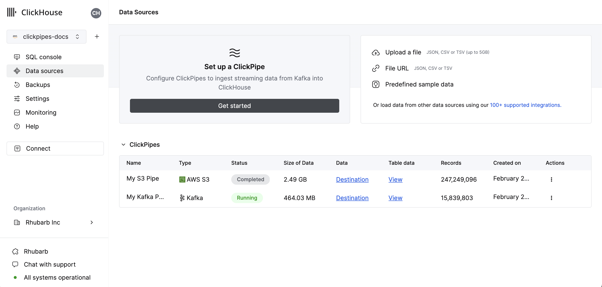
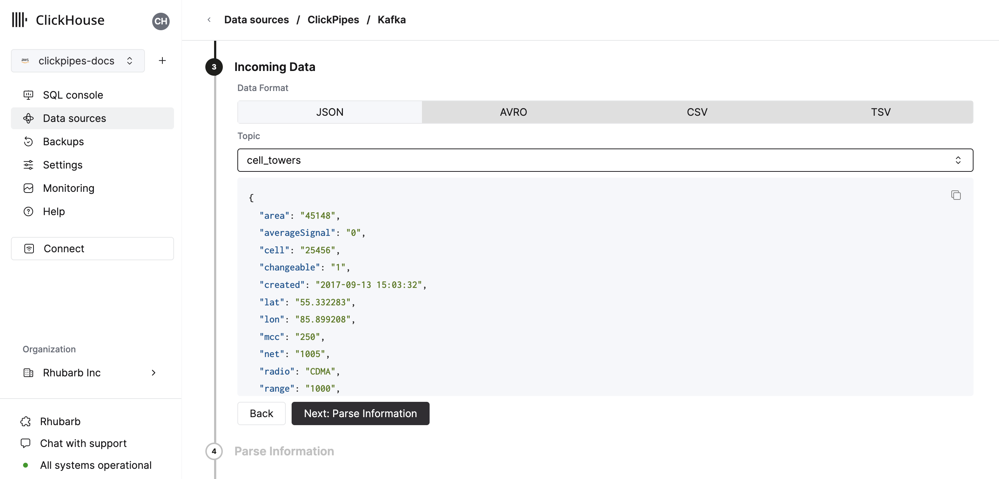
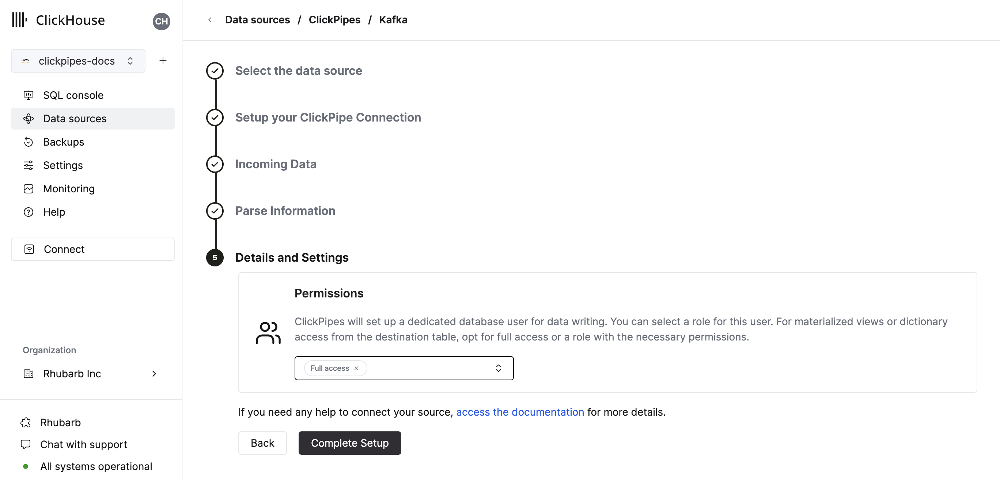
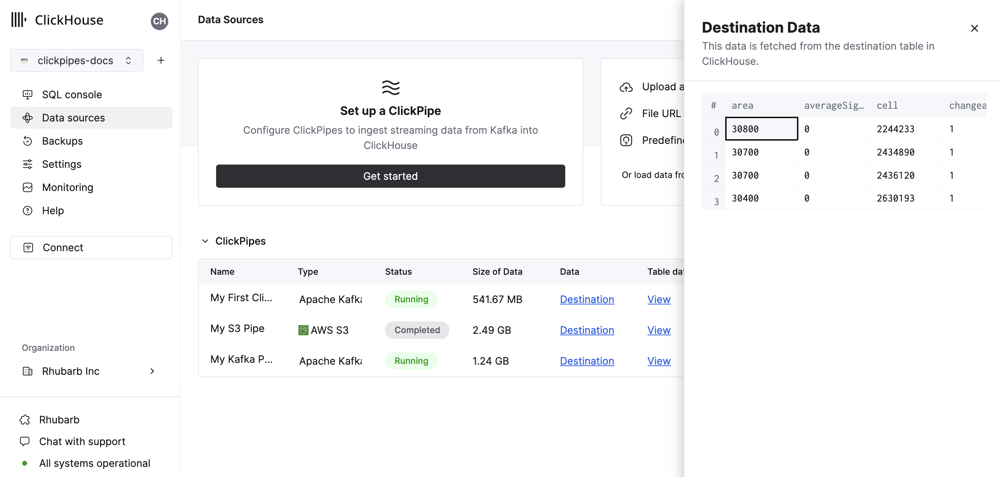

import KafkaSVG from "../../images/logos/kafka.svg";
import ConfluentSVG from "../../images/logos/confluent.svg";
import MskSVG from "../../images/logos/msk.svg";
import AzureEventHubsSVG from "../../images/logos/azure_event_hubs.svg";
import UpstashSVG from "../../images/logos/upstash.svg";
import WarpStreamSVG from "../../images/logos/warpstream.svg";

# Integrating Kafka with ClickHouse Cloud
## Prerequisite
You have familiarized yourself with the [ClickPipes intro](./index.md).

## Creating your first Kafka ClickPipe

1. Access the SQL Console for your ClickHouse Cloud Service.

  

2. Select the `Data Sources` button on the left-side menu and click on "Set up a ClickPipe"

  

3. Select your data source.

  

4. Fill out the form by providing your ClickPipe with a name, a description (optional), your credentials, and other connection details.
:::note
Currently ClickPipes does not support loading custom CA certificates.
:::

  

5. Configure the schema registry. A valid schema is required for Avro streams and optional for JSON. This schema will be used to parse [AvroConfluent](../../../interfaces/formats.md/#data-format-avro-confluent) or validate JSON messages on the selected topic.
- Avro messages that cannot be parsed or JSON messages that fail validation will generate an error.
- the "root" path of the schema registry.  For example, a Confluent Cloud schema registry URL is just an HTTPS url with no path, like `https://test-kk999.us-east-2.aws.confluent.cloud`  If only the root
path is specified, the schema used to determine column names and types in step 4 will be determined by the id embedded in the sampled Kafka messages.
- the path `/schemas/ids/[ID]` to the schema document by the numeric schema id. A complete url using a schema id would be `https://registry.example.com/schemas/ids/1000`
- the path `/subjects/[subject_name]` to the schema document by subject name.  Optionally, a specific version can be referenced by appending `/versions/[version]` to the url (otherwise ClickPipes
will retrieve the latest version).  A complete url using a schema subject would be `https://registry.example.com/subjects/events` or `https://registry/example.com/subjects/events/versions/4`

Note that in all cases ClickPipes will automatically retrieve an updated or different schema from the registry if indicated by the schema ID embedded in the message.  If the message is written
without an embedded schema id, then the specific schema ID or subject must be specified to parse all messages.

6. Select your topic and the UI will display a sample document from the topic.

  

7. In the next step, you can select whether you want to ingest data into a new ClickHouse table or reuse an existing one. Follow the instructions in the screen to modify your table name, schema, and settings. You can see a real-time preview of your changes in the sample table at the top.

  

  You can also customize the advanced settings using the controls provided

  

8. Alternatively, you can decide to ingest your data in an existing ClickHouse table. In that case, the UI will allow you to map fields from the source to the ClickHouse fields in the selected destination table.

  

9. Finally, you can configure permissions for the internal clickpipes user.

  **Permissions:** ClickPipes will create a dedicated user for writing data into a destination table. You can select a role for this internal user using a custom role or one of the predefined role:
    - `Full access`: with the full access to the cluster. It might be useful if you use Materialized View or Dictionary with the destination table.
    - `Only destination table`: with the `INSERT` permissions to the destination table only.

  

10. By clicking on "Complete Setup", the system will register you ClickPipe, and you'll be able to see it listed in the summary table.

  

  

  The summary table provides controls to display sample data from the source or the destination table in ClickHouse

  

  As well as controls to remove the ClickPipe and display a summary of the ingest job.

  

11. **Congratulations!** you have successfully set up your first ClickPipe. If this is a streaming ClickPipe it will be continuously running, ingesting data in real-time from your remote data source.

## Supported Data Sources

|Name|Logo|Type|Status|Description|
|----|----|----|------|-----------|
|Apache Kafka|<KafkaSVG style={{width: '3rem', 'height': '3rem'}} />|Streaming|Stable|Configure ClickPipes and start ingesting streaming data from Apache Kafka into ClickHouse Cloud.|
|Confluent Cloud|<ConfluentSVG style={{width: '3rem'}} />|Streaming|Stable|Unlock the combined power of Confluent and ClickHouse Cloud through our direct integration.|
|Redpanda||Streaming|Stable|Configure ClickPipes and start ingesting streaming data from RedPanda into ClickHouse Cloud.|
|AWS MSK|<MskSVG style={{width: '3rem', 'height': '3rem'}} />|Streaming|Stable|Configure ClickPipes and start ingesting streaming data from AWS MSK into ClickHouse Cloud.|
|Azure Event Hubs|<AzureEventHubsSVG style={{width: '3rem'}} />|Streaming|Stable|Configure ClickPipes and start ingesting streaming data from Azure Event Hubs into ClickHouse Cloud.|
|Upstash|<UpstashSVG style={{width: '3rem'}} />|Streaming|Stable|Configure ClickPipes and start ingesting streaming data from Upstash into ClickHouse Cloud.|
|WarpStream|<WarpStreamSVG style={{width: '3rem'}} />|Streaming|Stable|Configure ClickPipes and start ingesting streaming data from WarpStream into ClickHouse Cloud.|

More connectors are will get added to ClickPipes, you can find out more by [contacting us](https://clickhouse.com/company/contact?loc=clickpipes).

## Supported data formats for Kafka Streaming

The supported formats are:
- [JSON](../../../interfaces/formats.md/#json)
- [AvroConfluent](../../../interfaces/formats.md/#data-format-avro-confluent)

## Supported data types (JSON)

The following ClickHouse types are currently supported for JSON payloads:

- Base numeric types
  - Int8
  - Int16
  - Int32
  - Int64
  - UInt8
  - UInt16
  - UInt32
  - UInt64
  - Float32
  - Float64
- Boolean
- String
- FixedString
- Date, Date32
- DateTime, DateTime64
- Enum8/Enum16
- LowCardinality(String)
- Map with keys and values using any of the above types (including Nullables)
- Tuple and Array with elements using any of the above types (including Nullables, one level depth only)
- JSON/Object('json'). experimental

:::note
Nullable versions of the above are also supported with these exceptions:

- Nullable Enums are **not** supported
- LowCardinality(Nullable(String)) is **not** supported

:::

## Supported data types (Avro)

ClickPipes supports all Avro Primitive and Complex types, and all Avro Logical types except `time-millis`, `time-micros`, `local-timestamp-millis`, `local_timestamp-micros`, and `duration`.  Avro `record` types are converted to Tuple, `array` types to Array, and `map` to Map (string keys only).  In general the conversions listed [here](../../../../en/interfaces/formats.md#data-types-matching) are available.  We recommend using exact type matching for Avro numeric types, as ClickPipes does not check for overflow or precision loss on type conversion.

## Nullable Types and Avro Unions

Nullable types in Avro are defined by using a Union schema of `(T, null)` or `(null, T)` where T is the base Avro type.  During schema inference, such unions will be mapped to a ClickHouse "Nullable" column.  Note that ClickHouse does not support
`Nullable(Array)`, `Nullable(Map)`, or `Nullable(Tuple)` types.  Avro null unions for these types will be mapped to non-nullable versions (Avro Record types are mapped to a ClickHouse named Tuple).  Avro "nulls" for these types will be inserted as:
- An empty Array for a null Avro array
- An empty Map for a null Avro Map
- A named Tuple with all default/zero values for a null Avro Record

ClickPipes does not currently support schemas that contain other Avro Unions (this may change in the future with the maturity of the new Variant data type).  If the Avro schema contains a "non-null" union, ClickPipes will generate an error when attempting to calculate a mapping between the Avro schema and Clickhouse column types.

## Avro Schema Management

ClickPipes dynamically retrieves and applies the Avro schema from the configured Schema Registry using the schema ID embedded in each message/event.  Schema updates are detected and processed automatically.

At this time ClickPipes is only compatible with schema registries that use the [Confluent Schema Registry API](https://docs.confluent.io/platform/current/schema-registry/develop/api.html).  In addition to Confluent Kafka and Cloud, this includes the RedPanda, AWS MSK, and Upstash schema registries.  ClickPipes is not currently compatible with the AWS Glue Schema registry or the Azure Schema Registry (coming soon).

The following rules are applied to the mapping between the retrieved Avro schema and the ClickHouse destination table:
- If the Avro schema contains a field that is not included in the ClickHouse destination mapping, that field is ignored.
- If the Avro schema is missing a field defined in the ClickHouse destination mapping, the ClickHouse column will be populated with a "zero" value, such as 0 or an empty string.  Note that [DEFAULT](https://clickhouse.com/docs/en/sql-reference/statements/create/table#default) expressions are not currently evaluated for ClickPipes inserts (this is temporary limitation pending updates to the ClickHouse server default processing).
- If the Avro schema field and the ClickHouse column are incompatible, inserts of that row/message will fail, and the failure will be recorded in the ClickPipes errors table.  Note that several implicit conversions are supported (like between numeric types), but not all (for example, an Avro `record` field can not be inserted into an `Int32` ClickHouse column).

## Kafka Virtual Columns

The following virtual columns are supported for Kafka compatible streaming data sources.  When creating a new destination table virtual columns can be added by using the `Add Column` button.

| Name           | Description                                     | Recommended Data Type |
|----------------|-------------------------------------------------|-----------------------|
| _key           | Kafka Message Key                               | String                |
| _timestamp     | Kafka Timestamp (Millisecond precision)         | DateTime64(3)         |
| _partition     | Kafka Partition                                 | Int32                 |
| _offset        | Kafka Offset                                    | Int64                 |
| _topic         | Kafka Topic                                     | String                |
| _header_keys   | Parallel array of keys in the record Headers    | Array(String)         |
| _header_values | Parallel array of headers in the record Headers | Array(String)         |

## ClickPipes Limitations

- [DEFAULT](https://clickhouse.com/docs/en/sql-reference/statements/create/table#default) is not supported.

## Delivery semantics
ClickPipes for Kafka provides `at-least-once` delivery semantics (as one of the most commonly used approaches). We'd love to hear your feedback on delivery semantics [contact form](https://clickhouse.com/company/contact?loc=clickpipes). If you need exactly-once semantics, we recommend using our official [`clickhouse-kafka-connect`](https://clickhouse.com/blog/real-time-event-streaming-with-kafka-connect-confluent-cloud-clickhouse) sink.

## Authentication
For Apache Kafka protocol data sources, ClickPipes supports [SASL/PLAIN](https://docs.confluent.io/platform/current/kafka/authentication_sasl/authentication_sasl_plain.html) authentication with TLS encryption, as well as `SASL/SCRAM-SHA-256` and `SASL/SCRAM-SHA-512`. Depending on the streaming source (Redpanda, MSK, etc) will enable all or a subset of these auth mechanisms based on compatibility. If you auth needs differ please [give us feedback](https://clickhouse.com/company/contact?loc=clickpipes).

### IAM
AWS MSK authentication currently only supports [SASL/SCRAM-SHA-512](https://docs.aws.amazon.com/msk/latest/developerguide/msk-password.html) authentication.

## F.A.Q
- **How does ClickPipes for Kafka work?**

  ClickPipes uses a dedicated architecture running the Kafka Consumer API to read data from a specified topic and then inserts the data into a ClickHouse table on a specific ClickHouse Cloud service.

- **What's the difference between ClickPipes and the ClickHouse Kafka Table Engine?**

  The Kafka Table engine is a ClickHouse core capability that implements a “pull model” where the ClickHouse server itself connects to Kafka, pulls events then writes them locally.

  ClickPipes is a separate cloud service that runs independently of the ClickHouse Service, it connects to Kafka (or other data sources) and pushes events to an associated ClickHouse Cloud service. This decoupled architecture allows for superior operational flexibility, clear separation of concerns, scalable ingestion, graceful failure management, extensibility and more.

- **What are the requirements for using ClickPipes for Kafka?**

  In order to use ClickPipes for Kafka, you will need a running Kafka broker and a ClickHouse Cloud service with ClickPipes enabled. You will also need to ensure that ClickHouse Cloud can access your Kafka broker. This can be achieved by allowing remote connection on the Kafka side, whitelisting [ClickHouse Cloud Egress IP addresses](https://clickhouse.com/docs/en/manage/security/cloud-endpoints-api) in your Kafka setup.

- **Does ClickPipes for Kafka support AWS PrivateLink?**

  AWS PrivateLink is supported. Please [contact us](https://clickhouse.com/company/contact?loc=clickpipes) for more information.

- **Can I use ClickPipes for Kafka to write data to a Kafka topic?**

  No, the ClickPipes for Kafka is designed for reading data from Kafka topics, not writing data to them. To write data to a Kafka topic, you will need to use a dedicated Kafka producer.

- **Does ClickPipes support multiple brokers?**

  Yes, if the brokers are part of the same quorum they can be configured together delimited with `,`.
