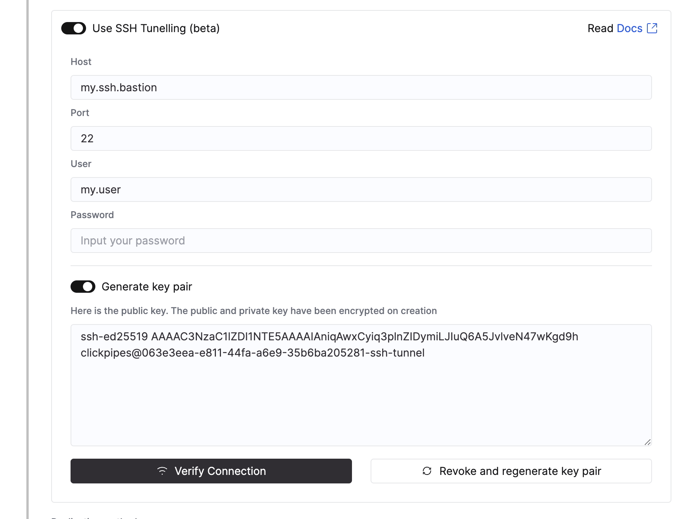
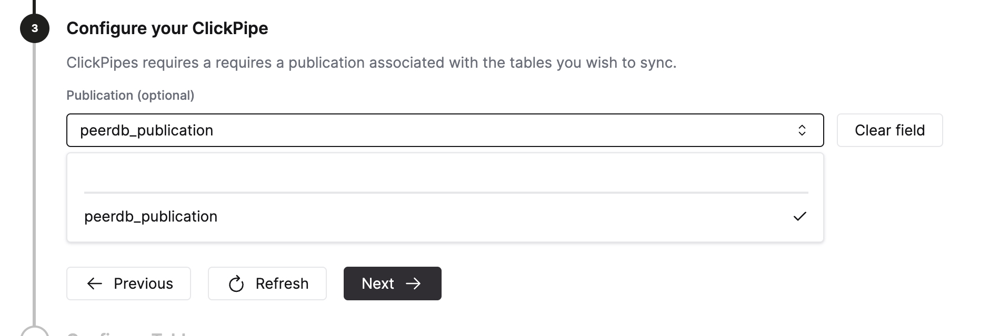
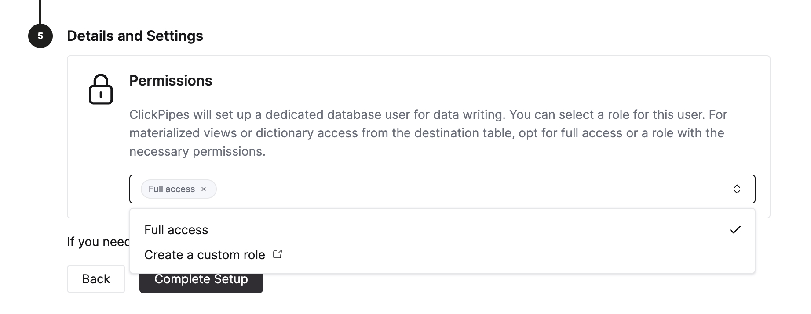

# Ingesting Data from Postgres to ClickHouse (using CDC)

:::info

Currently, ingesting data from Postgres to ClickHouse Cloud via ClickPipes is in Private Preview. If you are interested in trying it out, please sign up [here](https://clickpipes.peerdb.io/).

:::

You can use ClickPipes to ingest data from your source Postgres database into ClickHouse Cloud. The source Postgres database can be hosted on-premises or in the cloud including Amazon RDS, Google Cloud SQL, Azure Database for Postgres, Supabase and others.

## Prerequisites

To get started, you first need to make sure that your Postgres database is set up correctly. Depending on your source Postgres instance, you may follow any of the following guides:

1. [Amazon RDS Postgres](./postgres/source/rds)

2. [Suapabase Postgres](./postgres/source/supabase)

3. [Google Cloud SQL Postgres](./postgres/source/google-cloudsql)

4. [Azure Flexible Server for Postgres](./postgres/source/azure-flexible-server-postgres)

5. [Generic Postgres Source](./postgres/source/generic), if you are using any other Postgres provider or using a self-hosted instance

Once your source Postgres database is set up, you can continue creating your ClickPipe.

## Creating your ClickPipe

Make sure you are logged in to your ClickHouse Cloud account. If you don't have an account yet, you can sign up [here](https://cloud.clickhouse.com/).

[//]: # (   TODO update image here)
1. In the ClickHouse Cloud Console, navigate to your ClickHouse Cloud Service.

   

2. Select the `Data Sources` button on the left-side menu and click on "Set up a ClickPipe"

   

3. Select the `Postgres CDC` tile

   

### Adding your source Postgres database connection

4. Fill in the connection details for your source Postgres database which you configured in the prerequisites step.

   

 (Optional) Setting up SSH Tunneling 

You can specify SSH tunneling details if your source Postgres database is not publicly accessible.

1. Enable the "Use SSH Tunnelling" toggle.
2. Fill in the SSH connection details.

   

3. To use Key-based authentication, click on "Revoke and generate key pair" to generate a new key pair and copy the generated public key to your SSH server under `~/.ssh/authorized_keys`.
4. Click on "Verify Connection" to verify the connection.

:::note

Make sure to whitelist [ClickPipes IP addresses](../clickpipes#list-of-static-ips) in your firewall rules for the SSH bastion host so that ClickPipes can establish the SSH tunnel.

:::

Once the connection details are filled in, click on "Next".

### Configuring the replication settings

5. Make sure to select the replication slot from the dropdown list you created in the prerequisites step.

   

   

   
Advanced Settings

   You can configure the Advanced settings if needed. A brief description of each setting is provided below:
   - **Sync interval**: This is the interval at which ClickPipes will poll the source database for changes. This has implication on the destination ClickHouse service, for cost-sensitive users we recommend to keep this at a higher value (over `3600`).
   - **Parallel threads for initial load**: This is the number of parallel workers that will be used to fetch the initial snapshot. This is useful when you have a large number of tables and you want to control the number of parallel workers used to fetch the initial snapshot. This setting is per-table.
   - **Pull batch size**: The number of rows to fetch in a single batch. This is a best effort setting and may not be respected in all cases.
   - **Snapshot number of rows per partition**: This is the number of rows that will be fetched in each partition during the initial snapshot. This is useful when you have a large number of rows in your tables and you want to control the number of rows fetched in each partition.
   - **Snapshot number of tables in parallel**: This is the number of tables that will be fetched in parallel during the initial snapshot. This is useful when you have a large number of tables and you want to control the number of tables fetched in parallel.

   

### Configuring the tables

6. Here you can select the destination database for your ClickPipe. You can either select an existing database or create a new one.

   

7. You can select the tables you want to replicate from the source Postgres database. While selecting the tables, you can also choose to rename the tables in the destination ClickHouse database as well as exclude specific columns.

   :::warning

   If you are defining a Ordering Key in ClickHouse differently from the Primary Key in Postgres, please don’t forget to read all the [considerations](https://docs.peerdb.io/mirror/ordering-key-different) around it!
   
   :::

### Review permissions and start the ClickPipe

8. Select the "Full access" role from the permissions dropdown and click "Complete Setup".

   

## What's next?

Once you've moved data from Postgres to ClickHouse, the next obvious question is how to model your data in ClickHouse to make the most of it. Please refer to this page on [ClickHouse Data Modeling Tips for Postgres users](https://docs.peerdb.io/bestpractices/clickhouse_datamodeling) to help you model data in ClickHouse.

:::info

[This](https://docs.peerdb.io/bestpractices/clickhouse_datamodeling) is especially important as ClickHouse differs from Postgres, and you might encounter some surprises. This guide helps address potential pitfalls and ensures you can take full advantage of ClickHouse.

:::

