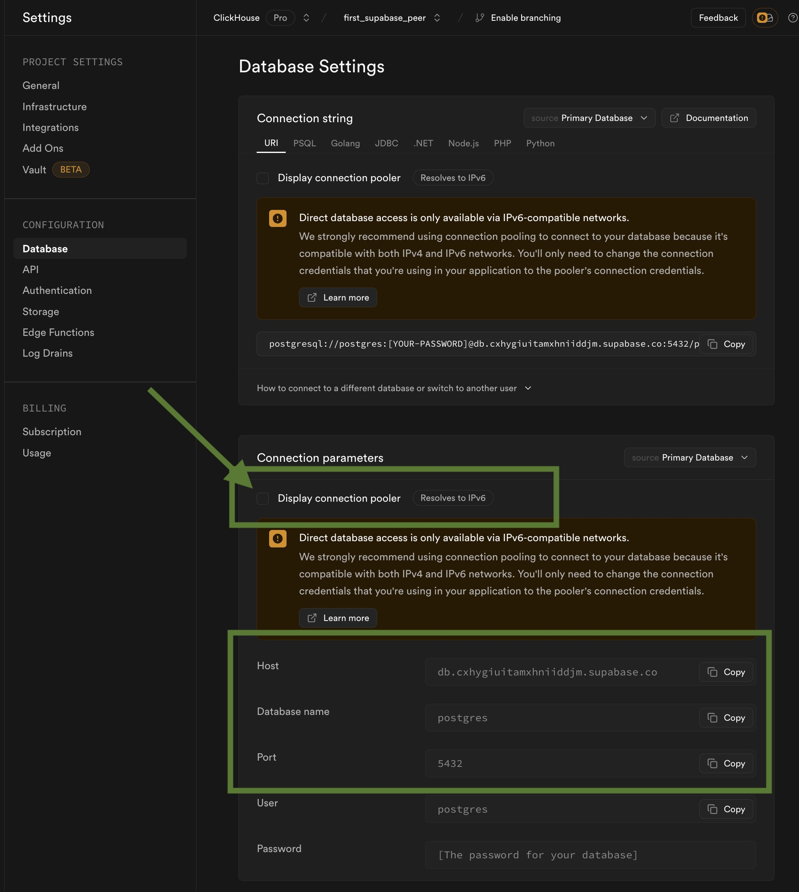

# Supabase Source Setup Guide

This is a guide on how to setup Supabase Postgres for usage in ClickPipes.

:::note

ClickPipes supports Supabase via IPv6 natively for seemless replication.

:::


## Creating a user with permissions and replication slot

Let's create a new user for ClickPipes with the necessary permissions suitable for CDC,
and also create a publication that we'll use for replication.

For this, you can head over to the **SQL Editor** for your Suapabase Project.
Here, we can run the following SQL commands:
```sql
  CREATE USER clickpipes_user PASSWORD 'clickpipes_password';
  GRANT USAGE ON SCHEMA "public" TO clickpipes_user;
  GRANT SELECT ON ALL TABLES IN SCHEMA "public" TO clickpipes_user;
  ALTER DEFAULT PRIVILEGES IN SCHEMA "public" GRANT SELECT ON TABLES TO clickpipes_user;

-- Give replication permission to the USER
  ALTER USER clickpipes_user REPLICATION;

-- Create a publication. We will use this when creating the mirror
  CREATE PUBLICATION clickpipes_publication FOR ALL TABLES;
```


Click on **Run** to have a publication and a user ready.

:::note

Make sure to replace `clickpipes_user` and `clickpipes_password` with your desired username and password.

Also, remember to use the same publication name when creating the mirror in ClickPipes.

:::


## Increase `max_slot_wal_keep_size`


:::warning

This step will restart your Supabase database and may cause a brief downtime.

:::warning

You can increase the `max_slot_wal_keep_size` parameter for your Supabase database to a higher value (at least 100GB or `102400`) by following the [Supabase Docs](https://supabase.com/docs/guides/database/custom-postgres-config#cli-supported-parameters)

For better recommendation of this value you can contact the ClickPipes team.


## Connection details to use for Supabase

Head over to your Supabase Project's `Project Settings` -> `Database` (under `Configuration`).

**Important**: Disable `Display connection pooler` on this page and head over to the `Connection parameters` section and note/copy the parameters.




:::info

The connection pooler is not supported for CDC based replication, hence it needs to be disabled.

:::


## What's next?

You can now [create your ClickPipe](../index.md) and start ingesting data from your Supabase Postgres instance into ClickHouse Cloud.
Make sure to note down the connection details you used while setting up your Supabase Postgres instance as you will need them during the ClickPipe creation process.


