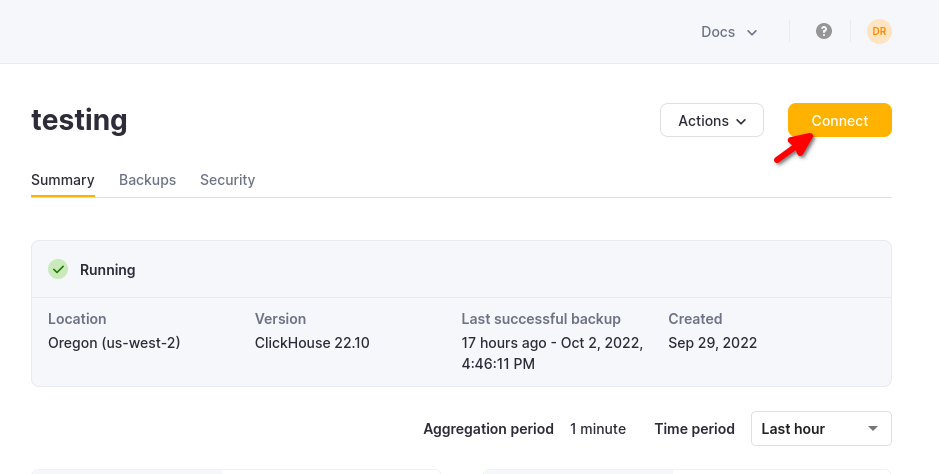
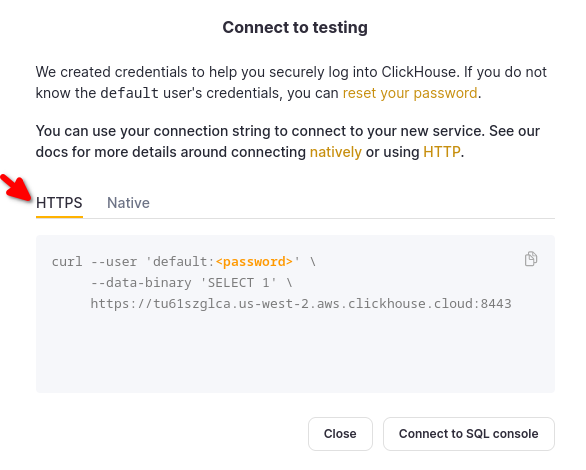

import ConnectionDetails from '@site/docs/en/_snippets/_gather_your_details_http.mdx';

## Using Vector with Kafka and ClickHouse

 Vector is a vendor-agnostic data pipeline with the ability to read from Kafka and send events to ClickHouse.

A [getting started](../etl-tools/vector-to-clickhouse.md) guide for Vector with ClickHouse focuses on the log use case and reading events from a file. We utilize the [Github sample dataset](https://datasets-documentation.s3.eu-west-3.amazonaws.com/kafka/github_all_columns.ndjson) with events held on a Kafka topic.

Vector utilizes [sources](https://vector.dev/docs/about/concepts/#sources) for retrieving data through a push or pull model. [Sinks](https://vector.dev/docs/about/concepts/#sinks) meanwhile provide a destination for events. We, therefore, utilize the Kafka source and ClickHouse sink. Note that whilst Kafka is supported as a Sink, a ClickHouse source is not available. Vector is as a result not appropriate for users wishing to transfer data to Kafka from ClickHouse.

Vector also supports the [transformation](https://vector.dev/docs/reference/configuration/transforms/) of data. This is beyond the scope of this guide. The user is referred to the Vector documentation should they need this on their dataset.

Note that the current implementation of the ClickHouse sink utilizes the HTTP interface. The ClickHouse sink does not support the use of a JSON schema at this time. Data must be published to Kafka in either plain JSON format or as Strings.

### License
Vector is distributed under the [MPL-2.0 License](https://github.com/vectordotdev/vector/blob/master/LICENSE)

#### Gather your connection details

To connect to ClickHouse with HTTP(S) you need this information:

- The HOST and PORT: typically, the port is 8443 when using TLS or 8123 when not using TLS.
- The DATABASE NAME: out of the box, there is a database named default, use the name of the database that you want to connect to.
- The USERNAME and PASSWORD: out of the box, the username is default. Use the username appropriate for your use case.

The details for your ClickHouse Cloud service are available in the ClickHouse Cloud console. Select the service that you will connect to and click Connect:



Choose HTTPS, and the details are available in an example curl command.



If you are using self-managed ClickHouse, the connection details are set by your ClickHouse administrator.

### Steps

1. Create the Kafka `github` topic and insert the [Github dataset](https://datasets-documentation.s3.eu-west-3.amazonaws.com/kafka/github_all_columns.ndjson).


```bash
cat /opt/data/github/github_all_columns.ndjson | kcat -b <host>:<port> -X security.protocol=sasl_ssl -X sasl.mechanisms=PLAIN -X sasl.username=<username> -X sasl.password=<password> -t github
```

This dataset consists of 200,000 rows focused on the `ClickHouse/ClickHouse` repository.

2. Ensure the target table is created. Below we use the default database.

```sql

CREATE TABLE github
(
    file_time DateTime,
    event_type Enum('CommitCommentEvent' = 1, 'CreateEvent' = 2, 'DeleteEvent' = 3, 'ForkEvent' = 4,
                    'GollumEvent' = 5, 'IssueCommentEvent' = 6, 'IssuesEvent' = 7, 'MemberEvent' = 8, 'PublicEvent' = 9, 'PullRequestEvent' = 10, 'PullRequestReviewCommentEvent' = 11, 'PushEvent' = 12, 'ReleaseEvent' = 13, 'SponsorshipEvent' = 14, 'WatchEvent' = 15, 'GistEvent' = 16, 'FollowEvent' = 17, 'DownloadEvent' = 18, 'PullRequestReviewEvent' = 19, 'ForkApplyEvent' = 20, 'Event' = 21, 'TeamAddEvent' = 22),
    actor_login LowCardinality(String),
    repo_name LowCardinality(String),
    created_at DateTime,
    updated_at DateTime,
    action Enum('none' = 0, 'created' = 1, 'added' = 2, 'edited' = 3, 'deleted' = 4, 'opened' = 5, 'closed' = 6, 'reopened' = 7, 'assigned' = 8, 'unassigned' = 9, 'labeled' = 10, 'unlabeled' = 11, 'review_requested' = 12, 'review_request_removed' = 13, 'synchronize' = 14, 'started' = 15, 'published' = 16, 'update' = 17, 'create' = 18, 'fork' = 19, 'merged' = 20),
    comment_id UInt64,
    path String,
    ref LowCardinality(String),
    ref_type Enum('none' = 0, 'branch' = 1, 'tag' = 2, 'repository' = 3, 'unknown' = 4),
    creator_user_login LowCardinality(String),
    number UInt32,
    title String,
    labels Array(LowCardinality(String)),
    state Enum('none' = 0, 'open' = 1, 'closed' = 2),
    assignee LowCardinality(String),
    assignees Array(LowCardinality(String)),
    closed_at DateTime,
    merged_at DateTime,
    merge_commit_sha String,
    requested_reviewers Array(LowCardinality(String)),
    merged_by LowCardinality(String),
    review_comments UInt32,
    member_login LowCardinality(String)
) ENGINE = MergeTree ORDER BY (event_type, repo_name, created_at);

```

3. [Download and install Vector](https://vector.dev/docs/setup/quickstart/). Create a `kafka.toml` configuration file and modify the values for your Kafka and ClickHouse instances.

```toml
[sources.github]
type = "kafka"
auto_offset_reset = "smallest"
bootstrap_servers = "<kafka_host>:<kafka_port>"
group_id = "vector"
topics = [ "github" ]
tls.enabled = true
sasl.enabled = true
sasl.mechanism = "PLAIN"
sasl.username = "<username>"
sasl.password = "<password>"
decoding.codec = "json"

[sinks.clickhouse]
type = "clickhouse"
inputs = ["github"]
endpoint = "http://localhost:8123"
database = "default"
table = "github"
skip_unknown_fields = true
auth.strategy = "basic"
auth.user = "username"
auth.password = "password"
buffer.max_events = 10000
batch.timeout_secs = 1
```

A few important notes on this configuration and behavior of Vector:

- This example has been tested against Confluent Cloud. Therefore, the `sasl.*` and `ssl.enabled` security options may not be appropriate in self-managed cases.
- A protocol prefix is not required for the configuration parameter `bootstrap_servers` e.g. `pkc-2396y.us-east-1.aws.confluent.cloud:9092`
- The source parameter `decoding.codec = "json"` ensures the message is passed to the ClickHouse sink as a single JSON object. If handling messages as Strings and using the default `bytes` value, the contents of the message will be appended to a field `message`. In most cases this will require processing in ClickHouse as described in the [Vector getting started](../etl-tools/vector-to-clickhouse.md#4-parse-the-logs) guide.
- Vector [adds a number of fields](https://vector.dev/docs/reference/configuration/sources/kafka/#output-data) to the messages. In our example, we ignore these fields in the ClickHouse sink via the configuration parameter `skip_unknown_fields = true`. This ignores fields that are not part of the target table schema. Feel free to adjust your schema to ensure these meta fields such as `offset` are added.
- Notice how the sink references of the source of events via the parameter `inputs`.
- Note the behavior of the ClickHouse sink as described [here](https://vector.dev/docs/reference/configuration/sinks/clickhouse/#buffers-and-batches). For optimal throughput, users may wish to tune the `buffer.max_events`, `batch.timeout_secs` and `batch.max_bytes` parameters. Per ClickHouse [recommendations](../../../concepts/why-clickhouse-is-so-fast.md#performance-when-inserting-data) a value of 1000 is should be considered a minimum for the number of events in any single batch. For uniform high throughput use cases, users may increase the parameter `buffer.max_events`. More variable throughputs may require changes in the parameter `batch.timeout_secs`
- The parameter `auto_offset_reset = "smallest"` forces the Kafka source to start from the start of the topic - thus ensuring we consume the messages published in step (1). Users may require different behavior. See [here](https://vector.dev/docs/reference/configuration/sources/kafka/#auto_offset_reset) for further details.

4. Start Vector

```bash
vector --config ./kafka.toml
```

By default, a [health check](https://vector.dev/docs/reference/configuration/sinks/clickhouse/#healthcheck) is required before insertions begin to ClickHouse. This ensures connectivity can be established and the schema read. Prepending `VECTOR_LOG=debug` can be helpful to obtain further logging should you encounter issues.

5. Confirm the insertion of the data.

```sql
SELECT count() as count FROM github;
```

| count |
| :--- |
| 200000 |
